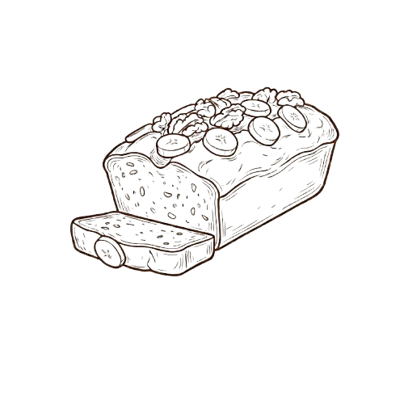

<div align="center">

  

  # 🍌 BananaBread
  
  **The Modern Academic Degree Planner for Technion Students**
  
  <p>
    <a href="https://ikaelguez21.github.io/bananabread/"><b>🌐 USE THE WEBSITE</b></a> •
    <a href="#-key-features">Features</a> •
    <a href="#-screenshots">Screenshots</a> •
    <a href="#-getting-started">Run Locally</a>
  </p>

  
  
  

</div>

---

### 🧐 What is BananaBread?

**BananaBread** is a sleek, browser-based interactive tool designed to revolutionize how students plan their academic path. Forget clunky spreadsheets and manual prerequisite checking. BananaBread visualizes your entire degree, tracks your progress, and ensures you never miss a prerequisite again.

**No installation needed!** Just visit the website to start planning immediately.

---

### 🚀 Getting Started

#### 🌐 Option 1: Use the Website (Recommended)
The easiest way to use BananaBread is online. The latest version is always available here:

## [👉 Click here to open BananaBread](https://ikaelguez21.github.io/bananabread/)

<br>

#### 💻 Option 2: Run Locally
If you prefer to run the project on your own machine (no server required):

1.  **Clone the repository:**
    ```bash
    git clone [https://github.com/ikaelguez21/bananabread.git](https://github.com/ikaelguez21/bananabread.git)
    ```
2.  **Navigate to the folder:**
    ```bash
    cd BananaBread-main
    ```
3.  **Launch:**
    Double-click `index.html` to open it in your favorite web browser (Chrome, Edge, Firefox, Safari).

---

### ✨ Key Features

| Feature | Description |
| :--- | :--- |
| **🎓 Smart Tracks** | Instantly load official degree tracks (CS, Medicine, Engineering, etc.) directly from Technion catalogs. |
| **🖱️ Drag & Drop** | Effortlessly drag courses between semesters to craft your perfect schedule. |
| **🔗 Visual Dependencies** | **Dynamic connecting lines** visualize course prerequisites (ancestors) and blocking chains in real-time when hovering. |
| **🧠 Intelligent Logic** | Automatic validation checks for prerequisites and alerts you if a course is misplaced. |
| **🌗 Dark Mode** | A beautiful, fully integrated Dark Mode for comfortable late-night study sessions. |
| **💾 Auto-Save** | Your plan is saved locally to your browser. Close the tab and pick up right where you left off. |
| **📊 Live Stats** | Real-time progress bar tracking your completed credit points against degree requirements. |
| **🎨 Faculty Coding** | Courses are color-coded by faculty (e.g., CS is Emerald, Math is Blue) for instant recognition. |

---

### 📸 Screenshots

Experience planning in your preferred style with powerful visualization tools.

#### ☀️ Light Mode & Dependency Visualization
*Hovering over a course instantly reveals its prerequisites and the courses it blocks.*


<br>

#### 🌑 Dark Mode & Drag-and-Drop Planning
*Easily rearrange your entire degree plan in a sleek dark theme.*


---

### ⚠️ A Note on Development

**BananaBread is currently a Work in Progress (WIP).**

While fully functional for planning, you may encounter occasional bugs, data discrepancies in course catalogs, or incomplete track definitions. We are actively working to improve the stability, data accuracy, and feature set of the tool.

Feedback and bug reports via GitHub issues are highly appreciated!

---

### 🛠 Tech Stack

BananaBread is built with modern web technologies, focusing on performance and simplicity (no complex build step required!).

*  **Core Framework**
*  **Styling & Dark Mode**
*  **Data Parsing**
* **Babel Standalone** **In-Browser JSX**

---

### 🤝 Credits & Contribution

Built with ❤️ by Technion students for the community.

* **Icons:** [Lucide React](https://lucide.dev/)
* **Data Source:** Technion Academic Catalog

Feel free to fork this repository and submit Pull Requests!

---

<div align="center">
  <sub>Enjoy planning with 🍌 BananaBread!</sub>
</div>
